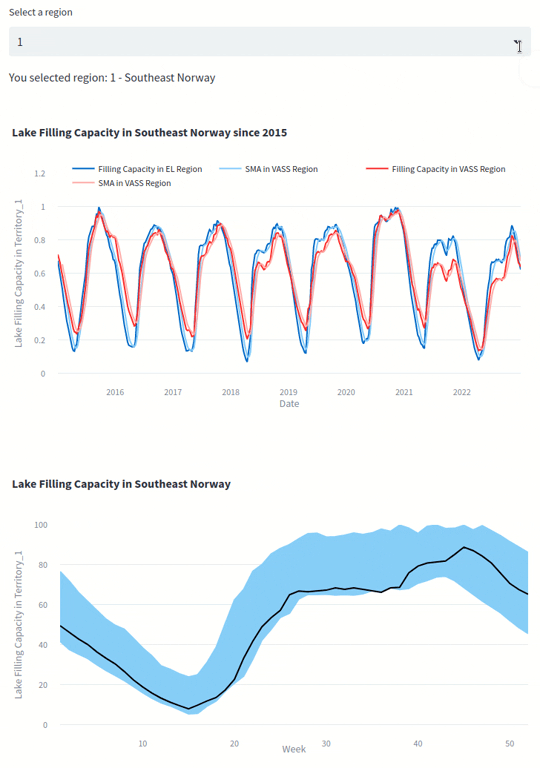
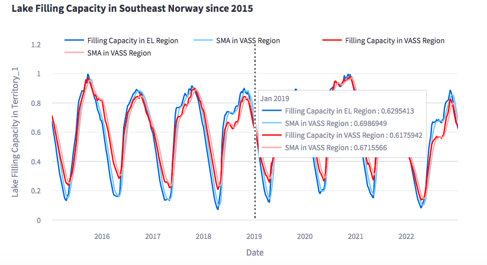
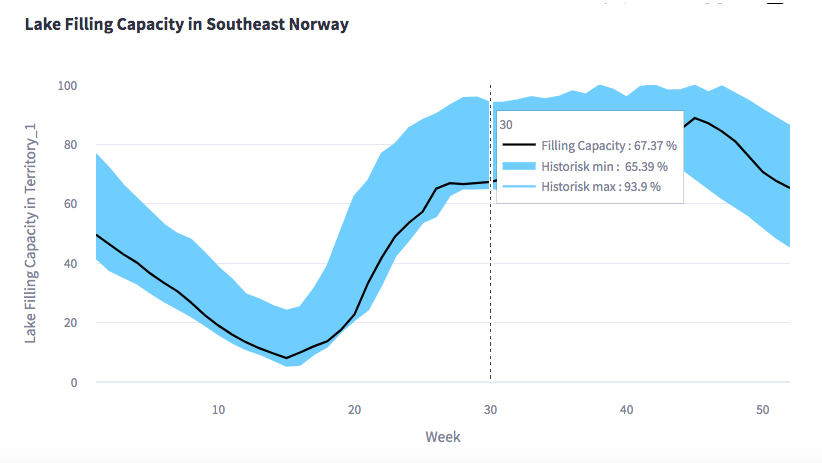
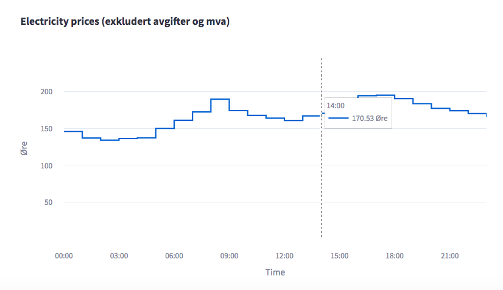

# Water Filling Levels and Electricity Prices in Norway Visualisation using StreamLit, plotly and pandas


Try it out the 
[filling levels](https://mariaaat-magasinst-srcmagasinstatistikkmagasinstatistikk-uwxy6o.streamlit.app) 
and 
[electricity prices](https://mariaaat-magasins-srcmagasinstatistikkelectricity-prices-gz48px.streamlit.app/) demos yourself!




## Project's Overview

*"Water and energy are linked"* in ways as many authors in different bibliographies affirm. This link is even more "visible" in Norway, where hydropower is the primary energy source in this country (more than 96%). Therefore, due to my interest in the environmental field and Data Analysis I created this project using the Python libraries StreamLit and plotly to visualise **interactive plots** of:
  1. The water filling capacity of lakes in the five regions of Norway (i.e., Oslo, Kristiansand, Trondheim, Tromsø and Bergen) over the years.
  2. The last year's water filling capacity of lakes compared with historical values.
  3. Electricity prices from the current and next day. 

### Data Acquisition

The water filling capacity data was obtained from the [NVE's API](http://api.nve.no/doc/magasinstatistikk/), whereas the energy prices data from the [Hvakosterstrommen API](https://www.hvakosterstrommen.no/strompris-api).
An API key wasn't required to get the values.

## Installation

This runs in any operating system and can be installed via `pip` directly from GitHub.

```
$ git clone git@github.com:MariaaAT/magasinstatistikk.git
$ cd magasinstatistikk/
$ pip install -r requirements.txt
```

In order to run the project and see the water filling capacity graphs, run the following command:

```
$ streamlit run src/magasinstatistikk/magasinstatistikk.py
```

In order to run the project and see the electricity prices graphs, run the following:

```
$ streamlit run src/magasinstatistikk/electricity_prices.py
```

When installing StreamLit under OSX, pyarrow didn't compile. I installed the precompiled version of pyarrow instead. 

```
$ pip install --extra-index-url https://pypi.fury.io/arrow-nightlies --prefer-binary --pre pyarrow
```

## For developers
### Water Filling Capacity

There are two different functions to plotting in `magasinstatistikk.py`.

The function `filling_capacity` will plot the water filling capacity from the different regions of Norway over the years. 



The function `min_max_plot` will draw the last 52 weeks water filling capacity compared to its historical counterparts. 



### Electricity Prices

The function `price_plot` is used and can be found in `electricity_prices.py`



## Lessons learnt

- [x] Data Analysis using Pandas and Jupyter Notebook.
- [x] Data Visualization using StreamLit and plotly.
- [x] Transforming data from APIs.

## Future challenges

*"Perfection is attained by slow degrees; it requires the hand of time."*
                                                                        - *Voltaire*

The following improvements are expected to make:
- [ ] Update hover-label from historical graph.
- [ ] Include historical values from electricity prices.
- [ ] Combine filling capacity data with electricity prices and search for correlations.
- [ ] Observe how climate change has affected, affects and will affect these two studied fields.


